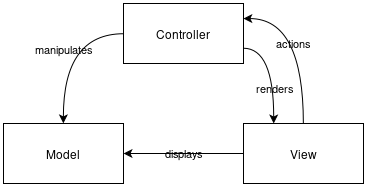
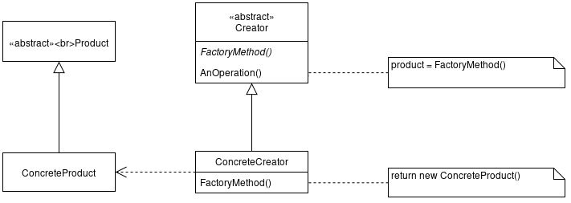

# LPO0504 - Island Defense 

Este trabalho tem como objetivo a criação dum jogo com base na junção de dois conceitos distintos, o de um Tower Defender e o de uma Batalha Naval. Sendo assim, o jogo tem como objetivo destruir barcos inimigos que se aproximam de uma ilha. É usado o terminal Lanterna em Java para efeitos de desenvolvimento do projeto. 

Este projeto foi desenvolvido por *Guilherme Valler Moreira* (up202007036@fe.up.pt), *Rui Brogueira Andrade* (up202007539@fe.up.pt) e *Manel Anselmo Moreira* (up201402718@fe.up.pt) para LDTS 2021-22.

## 1. Implemented Features

### 1.1 Features Implementadas

- **Terminal do jogo** - Usando o screen do Lanterna em Java representamos o mapa do jogo. Este mapa é constituído por uma ilha randomizada, dependendo do nível de dificuldade, ou costumizado, por barcos que se vão aproximando da ilha e por 'power-ups'. Todos estes elementos são apresentados como caracteres de terminal.

- **Movimento dos barcos** - Os barcos podem-se mover de duas maneiras diferentes, ou seguem a sua direção e avançam um espaço para a frente ou mudam a sua direção. Estes movimentos nunca podem ser no sentido de se afastarem da ilha. Os barcos movem-se logo a seguir ao jogador mandar um tiro. Cada um dos barcos tem movimentos independentes.

- **Movimento da mira** - O jogador pode movimentar a mira com as setas do teclado de acordo com o alvo que deseja acertar. Assim a mira movimenta-se em qualquer sentido ortogonal, desde que este não passe dos limites do mapa.

- **Níveis de dificuldade** - Com o aumento do número do nível, aumenta a dificuldade do mesmo. Isto é, o tamanho dos barcos, da ilha do jogador e o número de barcos aumentam.

- **Leitura de instruções** - No menu principal, ao entrar no sub-menu 2 (Instruções), lê um ficheiro de texto e projeta-o no ecrã.

### 1.2 Features a Implementar

- **Power-ups** - Quando o jogador mira e manda um tiro num quadrado onde está um power-up, é acionado o power-up. Estes podem ser de diversos tipos, tiros mais poderosos ou ganhar tempo fazendo com que os barcos não se mexam durante alguns turnos.

- **Modo infinito** - O modo infinito partilha as regras do modo normal, mas só acaba quando o jogador perder e vai aumento a dificuldade gradualmente.

- **Leaderboards** - Para manter o jogo competitivo, o modo infinito tem uma leaderboard onde os jogadores podem ver as melhores pontuações e quem as obteve.

- **Importe de mapas** - É possível o jogador iniciar um jogo com um mapa feito por si a partir dum ficheiro de texto.

- **Leitura dos leaderboards** - No fim do modo infinito é lido o leaderboard a partir dum ficheiro de texto e, caso seja uma ronda que mereça estar no leaderboard, é escrito o nome do jogador e a pontuação para esse ficheiro de texto.

- **Modo Sandbox** - O utilizador consegue escolher tudo acerca do seu nível: a localização da sua ilha, o seu tamanho e o número de barcos.

## 2. Design

### General Structure

#### O Problema em Contexto:

O nosso primeiro problema foi a decisaão entre algumas estruturas possíveis. Visto que estamos a utilizar um GUI e game states diferentes, tivemos de pensar num modelo (pattern) que satisfazesse as nossas necessidades.

#### O Modelo (Pattern):

Neste projeto implementamos um design principal, o Modelo Arquitectural (Architectural Pattern), mais especificamente o MVC (Model-View-Controller) que é normalmente usado em GUI.

  

#### Implementação: 

No que toca à implementação, temos três tipos de classes com o propósito de guardar informação, controlar a lógica do jogo e organizar os efeitos visuais do jogo no ecrã, que são, respetivamente, as classes model, controllers e viewers. Estas classes mvc estão interligadas entre si da seguinte maneira: 

  

  <b><i>Fig 1. Modelo MVC (Model, Controller e Viewer)</i></b>

#### Consequências:
- Um código bem organizado de acordo com o *Single Responsibility Principle*.
- Facilidade em implementar novas features

### **Model**

Neste package estão as classes responsáveis por guardar os estados dos objetos e os métodos get e set para podermos controlar através do controller os estados de jogo. Assim, a informação contida nas classes não é estática, estando em constante mudança dependendo dos inputs do jogador. O código usado para criar os níveis também se encontra no package Model por ser informação relativamente a cada nível individual. A classe ArenaModelFactory é esta classe de criação dos níveis onde se cria e adiciona a uma lista de barcos, ilhas e borders, os barcos, ilhas e borders a ter em cada nível. Depois os níveis são criados, chamando estes métodos de criação respetivos e referentes a cada nível.

  

### **Controller**

A única classe responsável pelos controladores do jogo é a Arena_Controller. Esta classe funciona como controladora do jogo, fazendo verificações necessárias para estar de acordo com a lógica de jogo. Métodos como ShipHitsIsle para verificar as condições de final de jogo. Por uma questão de eventualmente mais classes poderem ser adicionadas neste package, criamos uma classe abstrata Controller que inicializa um model para poder ser passado as classes do tipo Controller sem ser necessário inicializar em todas.

  

### **View**

Esta package é responsável pelo desenho de menus e do jogo em si. A decisão foi de criar uma interface que implementa um draw() para nos obrigar a que todas as classes que serão uma implementação desta interface terem um método draw do mesmo tipo e que se desenhem a elas próprias.

  

De seguida, como todas as classes estavam a inicializar um screen, foi decidido também adicionar uma classe abstrata AbstractView, que faz essa inicialização e todas as classes que são um extend desta não necessitam então de ter repetida a instanciação do screen.

  

Assim, todas as classes são um extend da AbstractView que implementa View, todas as classes desenham-se a elas próprias a partir do método draw() e na Arena_View são todos chamadas a partir dum getAllViews para poderem ser desenhadas em série.

Para além disso, temos uma máquina de estados a verificar as seleções de opções no menu e de níveis no menu de níveis.

### **Criador de Níveis**

#### O Problema em Contexto:

Como temos vários níveis, para que os níveis não sejam todos iguais, tivemos de manualmente criar todos os níveis ao inserir a ilha, barcos e borders. Tínhamos de arranjar uma maneira do o fazer de forma mais automatizada, seguindo algum método que nos ajudasse a fazê-lo.

#### O Modelo (Pattern):

O modelo que pensamos foi o *Factory Method* que, resumindo, providencia-nos uma interface para inserir objeto para dentro de uma superclasse, mas permite que subclasses alterem o tipo de objeto que será criado.

#### Implementação:

A factory é responável for construir as bases, mas os "trabalhadores" é que realmente executam o trabalho. Neste caso, a ArenaModelFactory é a nossa factory e as subclasses são os trabalhadores. No que toca à implementação, a função AbstractView é uma função abstrata que sabe construir o nível, no entanto, só as suas subclasses é que têm os conteúdos necessários para o construir. O Arena_view, por exemplo, é uma das subclasses que consiste em decidir que nível vai ser criado de acordo com alguns inputs fornecidos pelo utilizador.

  

  <b><i>Fig 2. Criador de Níveis</i></b>

As classes podem ser encontradas nos seguintes ficheiros:

[ArenaModelFactory](../src/main/java/Model/ArenaModelFactory.java)
[AbstractView](../src/main/java/View/AbstractView.java)
[Arena_View](../src/main/java/View/Arena_View.java)

#### Consequências: 

- Conseguimos criar objetos passo-a-passo e correr passos recursivamente.
- Código mais fácil de ler e perceber, estando tudo agrupado na mesma classe.
- Remove a necessidade de implementar classes especificamete para a aplicação.

## 3. Game States

O Island Defense começa com o mapa ocupado por uma ilha e por um barco inimigo. Na ilha encontra-se o jogador cujo objetivo é não deixar os barcos chegarem à ilha.

### Modo Normal

No modo de jogo normal, o jogo termina quando todos os barcos previstos forem destruídos ou quando pelo menos um dos barcos consegue desembarcar na ilha. A ação do jogador que faz desenvolver os Game States é o tiro. Assim enquanto o jogador move a mira, os barcos inimigos não desenvolvem qualquer ação. Após o tiro acertar, num barco, água ou power-up, os barcos inimigos têm um turno para fazer um de dois movimentos permitidos, ou avançam um quadrado no sentido que se encontram ou mudam de direção. Estes dois movimentos têm como única condição serem todos no sentido de chegar à ilha, isto é, um barco que se encontr a ir em direção À ilha não pode mudar de direção no sentido de se afastar dela. Um barco inimigo desaparece quando todos os seus segmentos sofrem um tiro. O diagrama abaixo representa a lógica do jogo.

## 4. Known Code Smells And Refactoring Suggestions

#### **Large Class**
A Classe Arena_Controller usa muitos métodos sendo que a maior parte deles são usados para o comportamento dos navios. Nós tomamos esta decisão de modo a facilitar a implementação a short-term sendo que no futuro será mais confuso modificar estes métodos e classes. Uma maneira de resolver este Code Smells seria relocalizar os métodos nas respetivas classes nomeadamente todos os métodos relativos ao Ship no Ship_Controller e o process_key no hitmarker (move method).

#### **Switch Statements**
Na Classe Levels_View pode-se encontrar um switch case complexo no método Choose_Level. O nível de complexidade é causado pelo facto de a possibilidade do utilizador meter várias inputs diferentes. A única maneira de resolver isto seria reduzior o número de níveis e dar split do Case Character para outro método (extract method).

#### **Alternative classes with different interfaces e Duplicate Code**
Nas classes Player, Isle, Hitmarker, Border e Ships nós usamos as variáveis x e y para indicar a posição dos respetivos objetos. Para simplificar e prevenir código duplicado podiamos ter criado uma superclass Position e implementá-la nas classes referidas anteriormente (extract superclass).

#### **Dead Code e Speculative Generality**
Na class Levels_View existe uma variável pos que nunca é usada e na class Arena_Controller também se encontra o método Remove_Ships que acabou por não ser usado também, estes são ambos exemplos de dead. Para além disso nas classes Border, Hitmarker, Isle e Player são criados setters que também não são usados porque foram criados para serem usados no nosso planeado sandbox modo que nunca chegámos a implementar para esta parte do código podem-se aplicar dois code smells(Dead Code e Speculative Generality). Para os casos que eu acabei de referir podemos apenas apagar os métodos e as variáveis referidas que o codigo não iria perder nenhuma funcionalidade(delete code).

#### **Data Class**
Todas as classes modelo são Data Classes pois só contem métodos de obtenção de variáveis sendo que não têm qualquer tipo de impacto no comportamento do jogo. Isto é causado pelo padrão do **MVC** (Model-View-Controller) que faz com que o controller tenha a responsabilididade de implementar as funcionalidades de cada modelo. Isto não é um mau code smell porque só existe devido ao padrão de design usado.

#### **Feature envy**
Devido ao **MVC** (Model-View-Controller) o Arena_Controller tem "inveja" dos modelos e chama os seus métodos. Isto também é uma consequência deste padrão de design.

## 5. Testing

### Screenshot of coverage report

  

  <b><i>Fig 6. Code coverage screenshot</i></b>

### Link to mutation testing report
[Mutation tests](../build/reports/pitest/202105302045/index.html)

## 6. Self-evaluation

Cada um ajudou no que sabia melhor e acabamos por dividir o trabalho de forma mútua. Ajudou-nos a aprofundar o nosso conhecimento em jana e em métodos de estrutura de codigo.

- Guilherme Moreira: 33.3%
- Manel Moreira: 33.3%
- Rui Andrade: 33.3%
